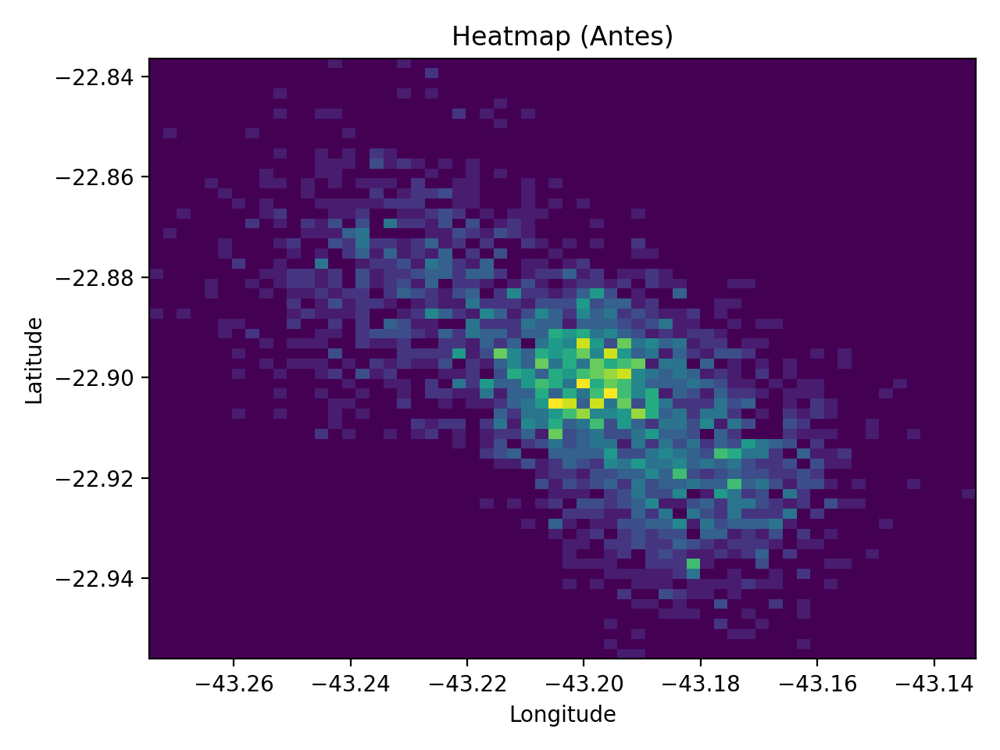
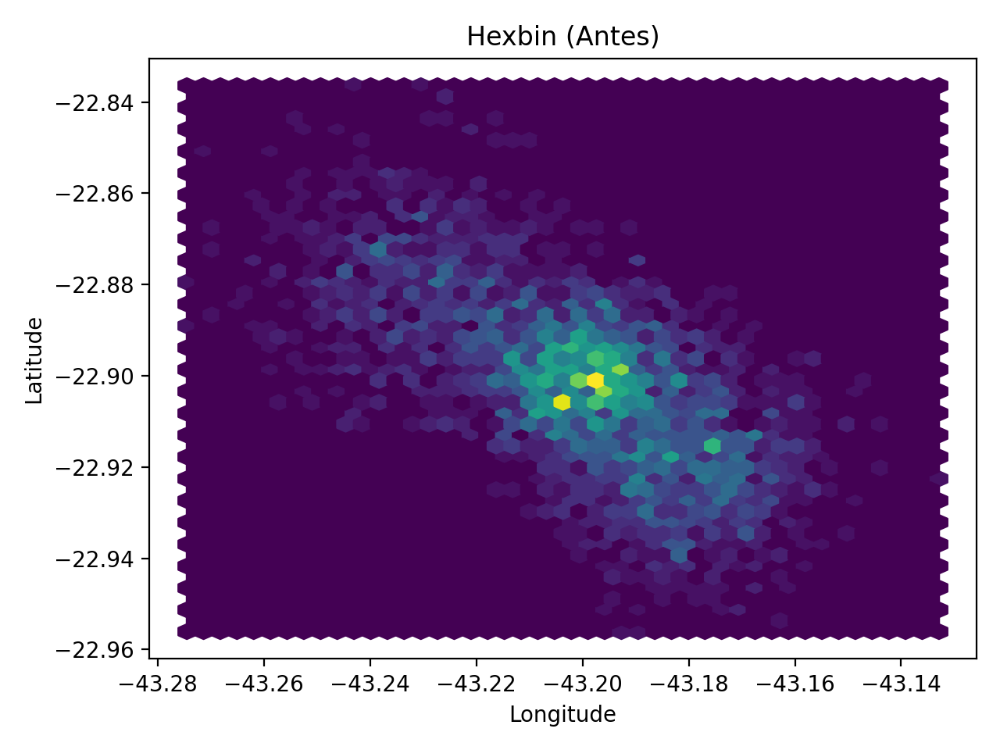
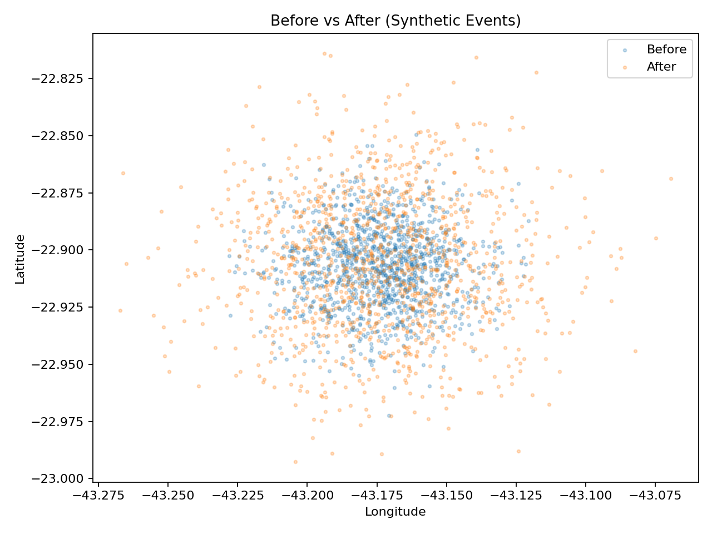
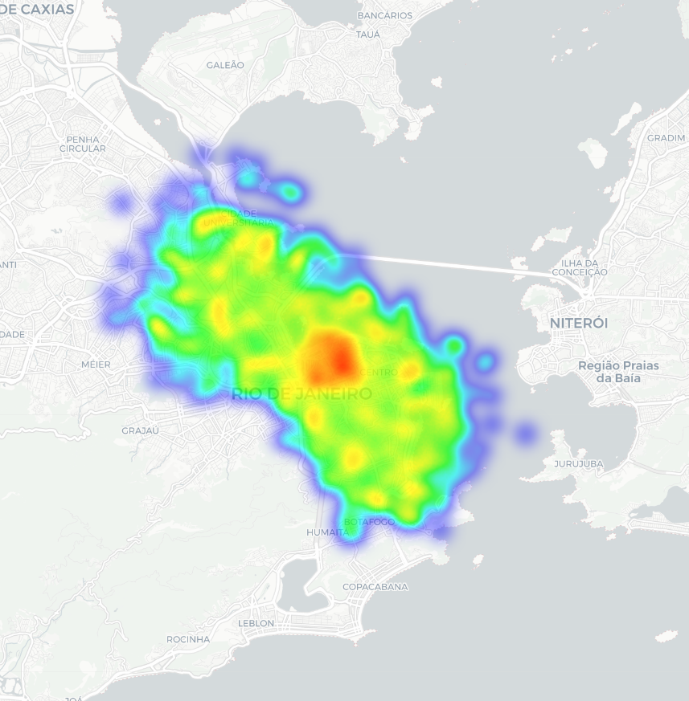
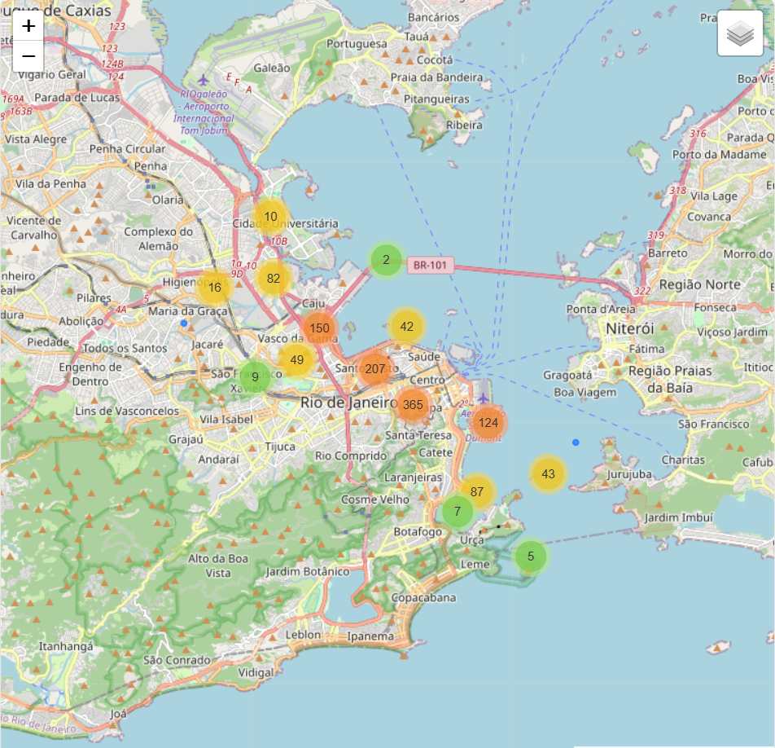

# Geo Policy Impact (Spatial Analytics)

Projeto de portfólio em Python para análise geoespacial com mapas,
heatmaps e visualizações espaciais.

## Estrutura
- notebooks/
- src/
- reports/figures/

## Como rodar
pip install -r requirements.txt
jupyter notebook

## Key visual outputs

## Interactive Maps (Folium)

[Open interactive heatmap](reports/maps/folium_heatmap_antes.html)  
[Open interactive cluster map](reports/maps/folium_cluster_antes_depois.html)

  
  

