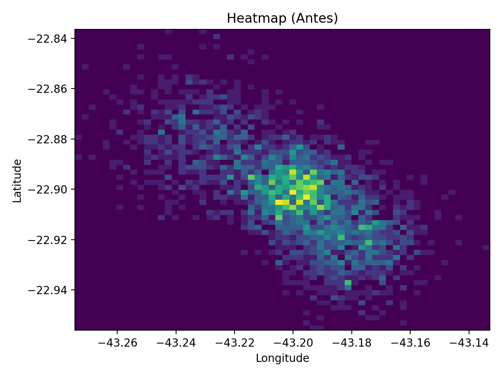
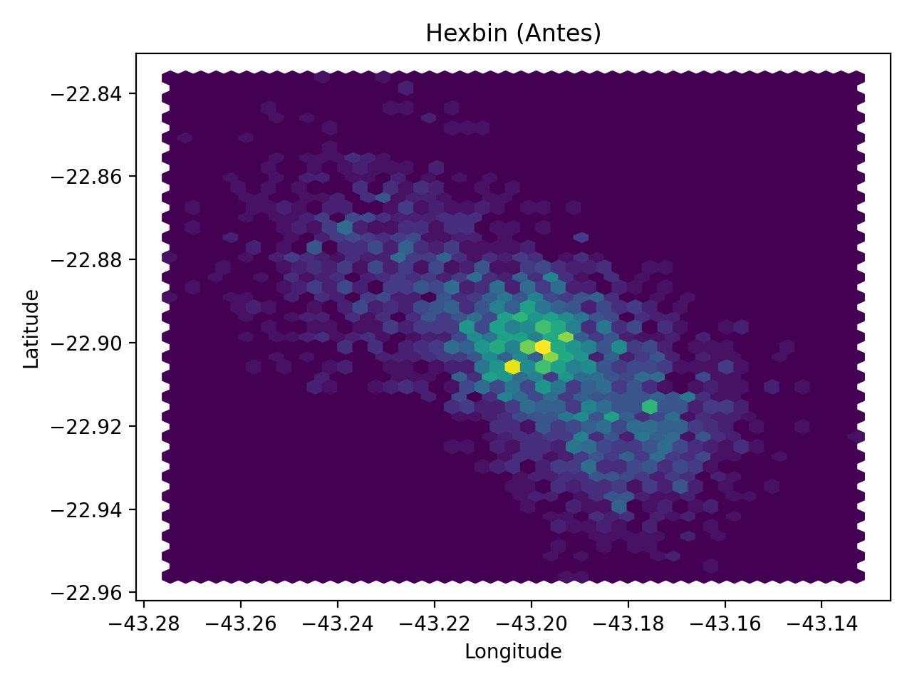
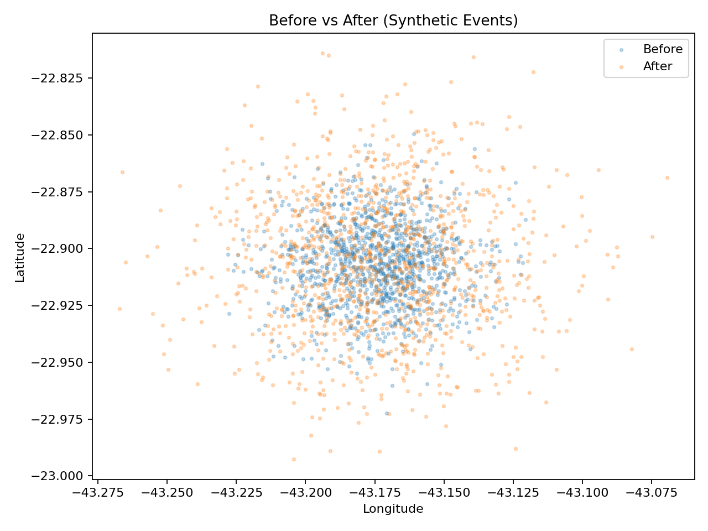
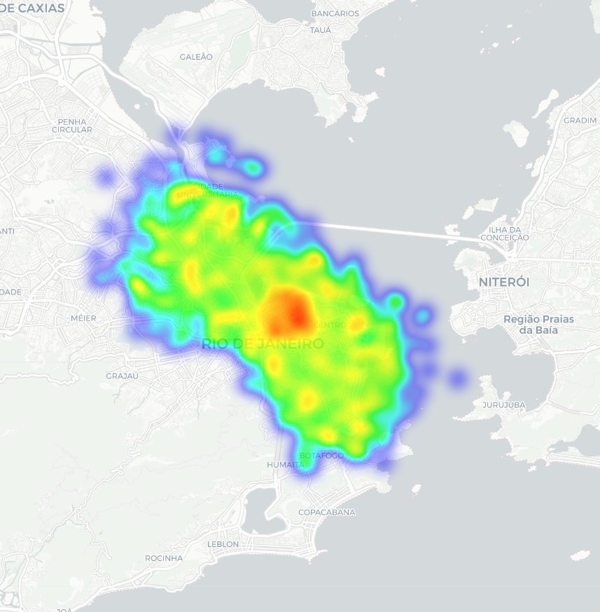
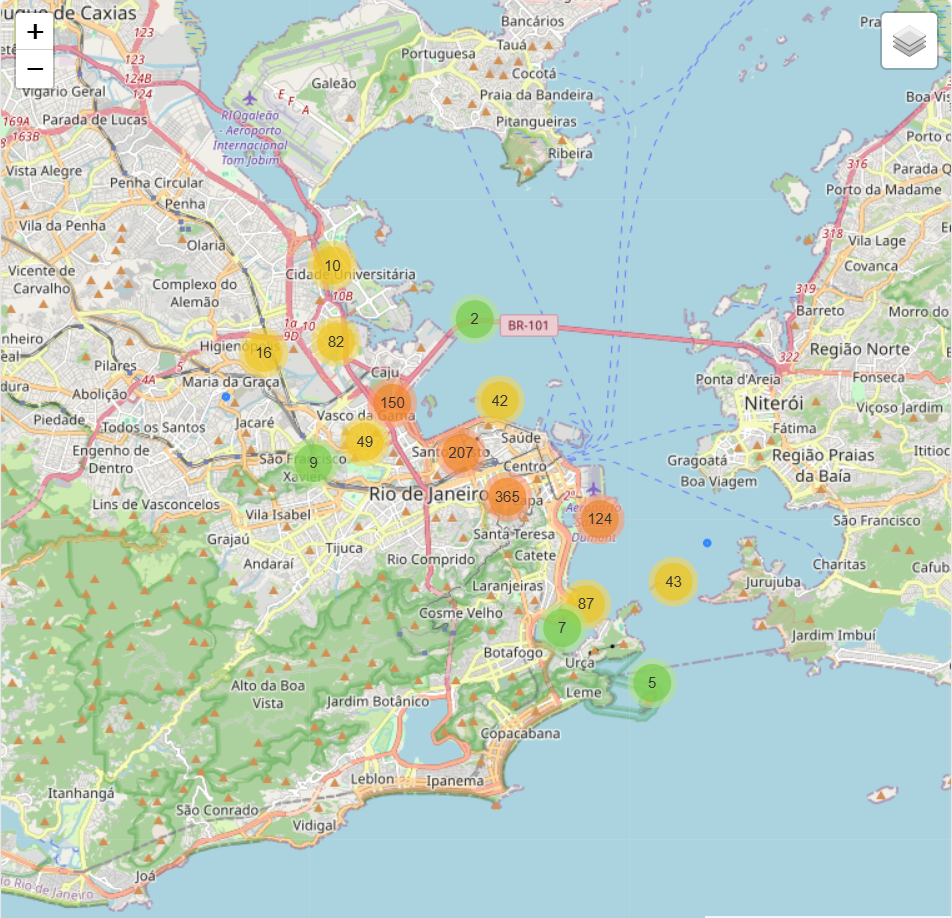

# Geo Policy Impact (Spatial Analytics)

Projeto de portfólio em Python para análise geoespacial com mapas,
heatmaps e visualizações espaciais.

## Estrutura


```
geo-policy-impact/
│
├── notebooks/
│   └── 01_simulation_and_maps.ipynb
│
├── src/
│   ├── data_generation.py
│   └── map_utils.py
│
├── reports/
│   ├── figures/
│   └── maps/
│
├── requirements.txt
└── README.md
```

## Como rodar
pip install -r requirements.txt
jupyter notebook

## Key visual outputs





## Interactive Maps (Folium)

[Open interactive heatmap](reports/maps/folium_heatmap_antes.html)  
[Open interactive cluster map](reports/maps/folium_cluster_antes_depois.html)

<p align="center">
  
  
</p>
